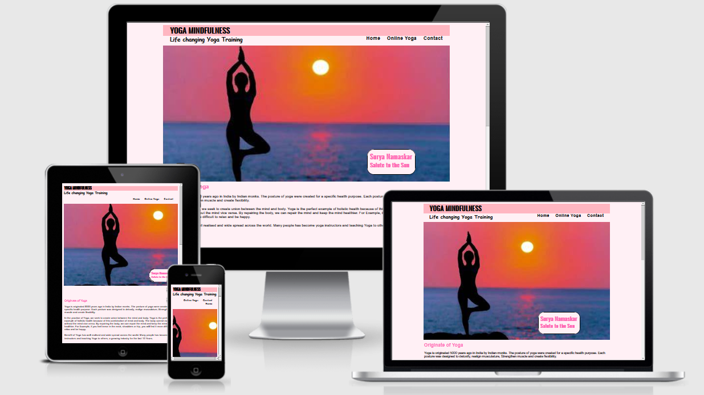
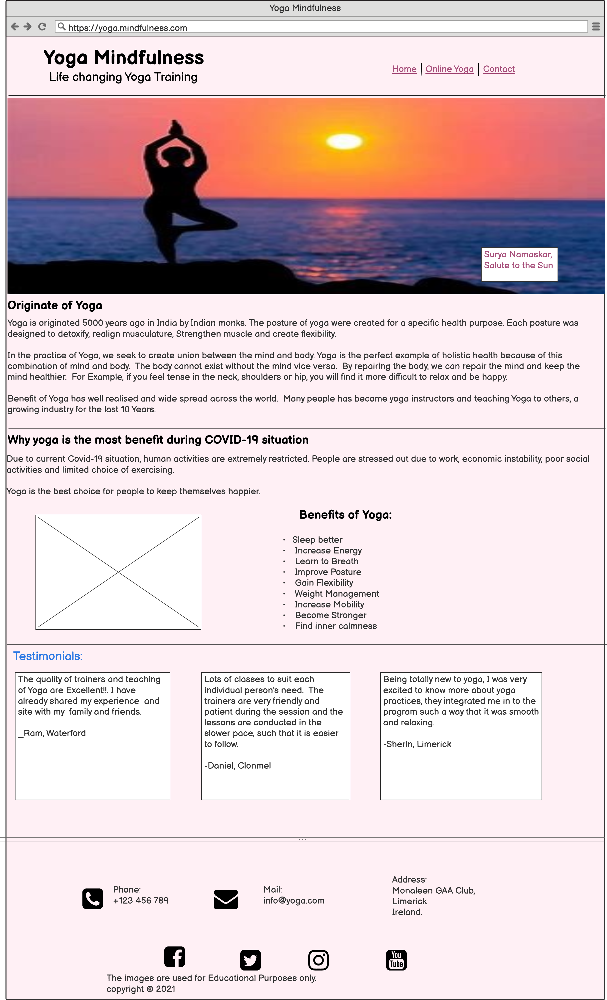

# Yoga Mindfulness

  

## Types of Content
- [Introduction](#introduction "Goto Indroduction")
  - [Home](#home "Goto Home section")
  - [Online Yoga](#online-yoga "Goto Online Yoga")
  - [Contact](#contact "Goto Contact")
- [Colours](#colours "Goto Colours Section")
- [UX](#ux "Goto UX")
  - [Business Vision](#business-vision "Goto Business Vision" )
- [Strategy](#strategy "Goto Strategy")
- [Scope](#scope "Goto Scope")
- [Structure](#structure "Goto Structure")
- [Wireframes](#wireframes)

## Introduction
- This project will cover the origination of yoga, types of yoga and how that has grown into well known industry in last couple of years. 

- It also covers, benefit in current Covid-19 situation.

- The webpage is categorised into three main section, such us Home, Online Yoga and contact.

- The website covers all the screen types, such as Pc,Laptop,Tablet and Mobile.

## Home
The home page covers the following section:
- Introduction of Yoga
- Hero Image
- Usefulness of Yoga in **Covid-19 situation**.
- Benefits of Yoga
- Testimonials
- Social media

## Online Yoga
The online yoga covers the following section:
- About the organisation
- Types of yoga and their description
- Price table
- Timing table for yoga session
- Header and footer same as in Homepage

This page provides the client sufficient information to decide to join the yoga training.

## Colours
I have used warm and light colours to create pleasant experience for those people to viewing this website.

## Contact
The final page is designed for clients and public enquires. The page contains following information:
- Name
- Gender
- Age
- Mobile Number
- Email Address
- Message box for clients and public to feedbcak their questions.
- Header and footer same as in Homepage

This is important for the yoga centre to improve their services and enhance future Business growth.

## UX

- As a user i want to learn more about when and where yoga was originated
- As a user i would like to know the benefits of the yoga
- As a user i would like to understand different types of yoga
- As a user i want to know the quality of trainers
- As a user i would like to know how long the yoga centre is conducting the yoga training
- As a user i would like to know the price and timing available for the yoga training
- As a user i would like to know how to query my question to yoga centre.

### Business Vision
The website is created to communicate to the public, the benefits of yoga and how to enrol in to the yoga training session.
The yoga training is designed to learn and follow via online.
Very experienced and well trained instructors are conducting the training session. The online training is designed for all age groups above 6 years old. The training is priced at affordable rate. The centre appreciate every feedback from the client.

## Strategy
The website covers all the screen types, such as Pc, Laptop, Tablet and Mobile. The website is easily navigate to all the sections.

## Scope
I want my user to understand the benefits of yoga. And how to enrol into the training session.

## Structure
This project is divided into three main pages. The website was better organised after my mentoring session with my mentor.
The website was structured such a way that the users can navigate to find relevant information according to their need.

# Wireframes

Yoga Homepage

