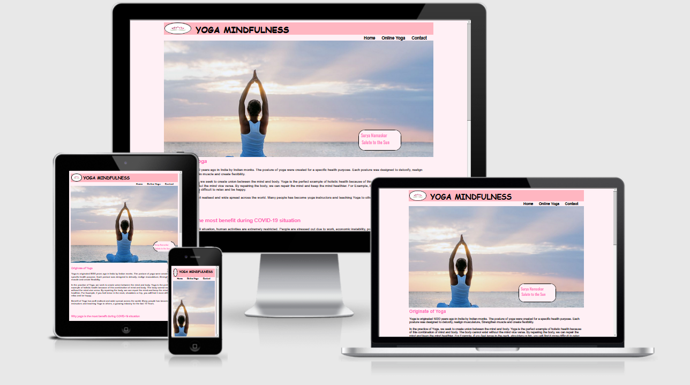
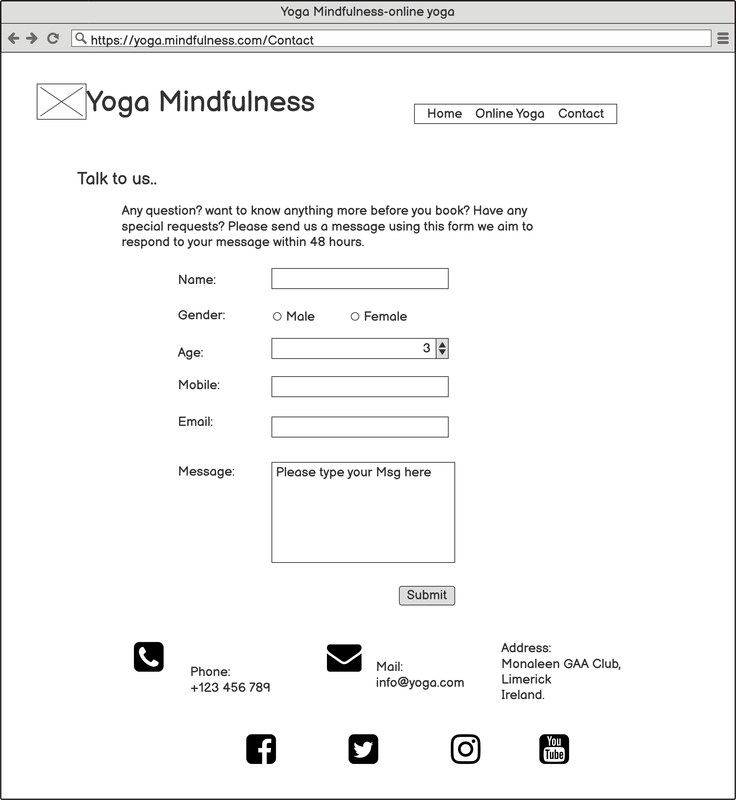

# Yoga Mindfulness

  

## Types of Content
- [Introduction](#introduction "Goto Indroduction")
  - [Home](#home "Goto Home section")
  - [Online Yoga](#online-yoga "Goto Online Yoga")
  - [Contact](#contact "Goto Contact")
- [Strategy](#strategy "Goto Strategy")   
  - [UX](#ux "Goto UX")
  - [Business Vision](#business-vision "Goto Business Vision")
  - [Purpose of Website](#purpose-of-website)
- [Scope](#scope "Goto Scope")
   - [Features](#features)
   - [Future Feature](#future-feature)
- [Structure](#structure "Goto Structure")
   - [Wireframes](#wireframes)
   - [Colours](#colours "Goto Colours Section")
- [Technologies Used](#technologies-used)
- [Testing](#testing)
- [Bugs](#bugs)
- [Deployment](#deployment)
- [Acknowledgement](#acknowledgement)

## Introduction
- This project will cover the origination of yoga, types of yoga and how that has grown into well known industry in last couple of years. 

- It also covers, benefit in current Covid-19 situation.

- The webpage is categorised into three main section, such us Home, Online Yoga and contact.

- The website covers all the screen types, such as Pc,Laptop,Tablet and Mobile.

### Home
The home page covers the following section:
- Introduction of Yoga
- Hero Image
- Usefulness of Yoga in **Covid-19 situation**.
- Benefits of Yoga
- Testimonials
- Social media

[Homepage-Mobile-1](docs/images/yoga-home-mobile.PNG)
 
[Homepage-Mobile-2](docs/images/Yoga-home-mobile-1.PNG)
 
[Homepage-Mobile-3](docs/images/Yoga-home-mobile-2.PNG)
 
[Homepage-Mobile-4](docs/images/Yoga-home-mobile-3.PNG)

### Online Yoga
The online yoga covers the following section:
- About the organisation
- Types of yoga and their description
- Price tablegit 
- Timing table for yoga session
- Header and footer same as in Homepage

This page provides the client sufficient information to decide to join the yoga training.

[Online Yoga-IPad-1](docs/images/online-yoga-ipad-1.PNG) 
[Online Yoga-IPad-2](docs/images/Online-yoga-ipad-2.PNG)
 
[Online Yoga-IPad-3](docs/images/Online-yoga-ipad-3.PNG)
 
[Online Yoga-IPad-4](docs/images/Online-yoga-ipad-4.PNG)
 
[Online Yoga-IPad-5](docs/images/Online-yoga-ipad-5.PNG)

### Contact
The final page is designed for clients and public enquires. The page contains following information:
- Name
- Gender
- Age
- Mobile Number
- Email Address
- Message box for clients and public to feedbcak their questions.
- Header and footer same as in Homepage

This is important for the yoga centre to improve their services and enhance future Business growth.

[Contact-IPad-1](docs/images/Contact-ipad-1.PNG)
 
[Contact-IPad-2](docs/images/contact-ipad-2.PNG)

## Strategy
The website covers all the screen types, such as Pc, Laptop, Tablet and Mobile. The website is easily navigate to all the sections.

### UX

- As a user i want to learn more about when and where yoga was originated
- As a user i would like to know the benefits of the yoga
- As a user i would like to understand different types of yoga
- As a user i want to know the quality of trainers
- As a user i would like to know how long the yoga centre is conducting the yoga training
- As a user i would like to know the price and timing available for the yoga training
- As a user i would like to know how to query my question to yoga centre.

### Business Vision
The website is created to communicate to the public, the benefits of yoga and how to enrol in to the yoga training session. 
The yoga training is designed to learn and follow via online. 
Very experienced and well trained instructors are conducting the training session. The online training is designed for all age groups above 6 years old. The training is priced at affordable rate. The centre appreciate every feedback from the client.

### Purpose of Website
Inspiration of this project comes from current Covid-19 situation where people are looking for alternative for keeping body and mind healthy.

## Scope
I want my user to understand the benefits of yoga. And how to enrol into the training session.

### Features
Header and Footer are commenly used in all pages.

Header: 
Header is consists of Name and Logo and located on the left side of the page. There are three menu options are available on the right side. The three menu options used are Home, Online Yoga and Contact.

Footer: 
Footer is consists of Social Networks icons such as Facebook, Twitter, Youtube and Instagram.

Home Page: 
Hero image is at the top of the page, with animation of 7 seconds. I have added the tooltip function in Hero-image cover text to enhance the message, the importance of Surya Namaskar.  Origination of yoga is described below the hero image. It also described why yoga is the better choice for Covid situation. 
Followed by Lists of benefits of yoga with image, also enhance the benefit of yoga by using of hover. And finally the page finishes with Testimonials from valuable customers.

Online Yoga: 
Second page is covers the topic of Yoga Mindfulness. This page covers about us, advise from yoga master and dedicating time to practice yoga. 
Followed by Types of yoga, there are 8 types of common yogas with images described in this page. the page finishes with date, time and Price list.

Contact: 
The final page covers enquiry form and contact details.
 
Contact form consists of the following fields and validation.
- Name: text, Mandatory.
- Gender: dropdown menu to select male or female, Mandatory.
- Age: type the number or select the number, Mandatory.
- phone: number text, Mandatory.
- Email: Email address is Mandatory.
- Message: text, Mandatory.
- Button to submit.
Thanks message is displayed after submitting. 
Finally it covers contact details such as Phone number, email and Address of Yoga Mindfulness.

### Future Features
- videos of each yoga type will help the viewers to understand the benefit of yoga.
- Live chat option will helpful for customers to gain confidence about our website and services.
- We like to use Paypal, Credit and Debit card services in future.

## Structure
This project is divided into three main pages. The website was better organised after my mentoring session with my mentor.
The website was structured such a way that the users can navigate to find relevant information according to their need.

### Wireframes

Balsamiq Wireframes used for this website.

Yoga Homepage

Yoga Homepage Mobile View

Online Yoga

Online Yoga Mobile View

Contact

Contact Mobile View

### Colours
I have used warm and light colours to create pleasant experience for those people to viewing this website.

## Technologies Used
- HTML-used for to create the website.
- CSS- used for style the website.
- GitHub- to save the project code and host the live project.
- GitPod- is an open source platform for automated and ready-to-code.
- Bootstrap- used for Quick and responsive design.
- Google Fonts-used for the website looks more beautiful,fast and great typography
- Font Awesome - icons used throughout the site.
- Responsive design - To generate the mockup image.

## Testing
- W3 Markup Validation Service- To validate HTML document, i used Validate by direct input, some errors shown, and then i fixed the errors. 
- W3 CSS Validation Service- To validate HTML document, i used validate by direct input, no errors shown, but 8 warning shown in the W3 validation page.
- Browser Testing

     I have used the most common browser to test my website,
  1. Mozilla Firefox
  2. Google Chrome
  3. Microsoft Edge

    All the pages Responsive and displaying the website in order.
- Mobile Testing

  I have verified the website in various mobiles like Galaxy S9,S3, i phone 6,7,8 and xiaomi max3 and makesure the website works properly.
- Features Testing

  All the features tabs are Responding properly as per design.
- Contact Form Testing

  Contact form was tested to makesure all the relevant information are filled before submitting.
  ## Bugs
  I have difficulties in aligning the pictures, by using the information of Youtube, Google and W3 School, managed to resolve the problem. 
  Next problem faced was thank you message did not display when the customer submit the enquiry. This problem was resolved with th help of Tutor and Mentor.

  ## Deployment
  Used Gitpod Workspace for coding. To preview the browser window need to type "python3 -m http.server" in the terminal window at the bottom.Afterthat, have to do git add for add files or remove files and do git commit for reasoning and do the git push for git hub repositary website.    
  Below the steps for deployment of my Yoga Mindfulness project using github.
  - In Github Repositary, click on Settings tab.
  - Then click on "Pages" tab in the left hand side sidebar.
  - Then under "Source" click the "None" dropdown and select the "Master" branch.
  - Followed by clicking "Save".

  The above steps have created the website URL "https://ksanthanesh.github.io/Yoga-Mindfulness/".

  # Acknowledgement

  - I would like to thank my mentor <b>Rohit Sharma</b> and my tutors <b>Kasia</b> and <b>Roman</b> for their helpfulness, constructive feedback and guidance when needed.
  - I would like to thank the staff and students of Code Institute for their help.
  - I also like to thank Slack Community for sharing the open discussion from various students.
  - Inspiration of this project comes from current Covid-19 situation where people are looking for alternative for keeping body and mind healthy.
  - The images on this site have been taken from Google Search and used only for education purpose to complete this project.
  - Benefits are taken from Google Search.

